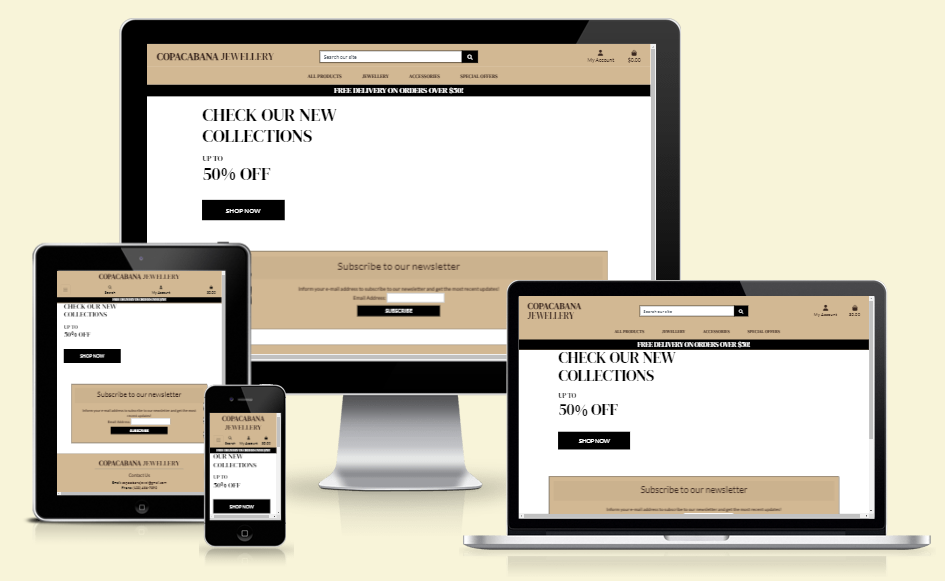

# Copacabana Jewellery Website



The website utilizes Stripe as the payment processor.
This example project was not created to simulate actual credit card transactions. Use the test card number 4242 4242 4242 4242 with any future expiration date, any three-digit CVC, and any five-digit zip code to test the functionality.

[Access the Copacabana Jewellery Website here](https://copacabana-jewellery.herokuapp.com/)(Ctrl + Click to open on a new tab)

## Table of Contents
1. [**UX**](#ux)
    - [**Purpose of the project**](#purpose-of-the-project)
    - [**User stories**](#user-stories)
    - [**Features**](#features)
    - [**Future features**](#future-features)

2. [**Typography and color scheme**](#typography-and-color-scheme)

3. [**Design**](#design)
    - [**Wireframes**](#wireframes)
    - [**ERD Diagrams**](#erd-diagrams)

4. [**Technologies Used**](#technologies-used)
    - [**Code validation**](#code-validation)
    - [**Test cases (user story based with screenshots)**](#test-cases)
    - [**Fixed bugs**](#fixed-bugs)
    - [**Supported screens and browsers**](#supported-screens-and-browsers)

5. [**Deployment**](#deployment)
    - [**Via Gitpod**](#via-gitpod)
    - [**Via Heroku**](#via-heroku)
    - [**Via ElephantSQL**](#via-elephantsql)
    - [**Via AWS**](#via-aws)
6. [**Credits**](#credits)

---
---

## UX

## Purpose of the project

Welcome to the exquisite jewellery e-commerce website `Copacabana Jewellery`! 

- Product description:

  This platform offers a wide range of high-quality and stylish jewellery pieces to our customers. Our online store features a collection of necklaces, bracelets, earrings, rings, and other jewellery and accessories, all designed to make you feel beautiful and confident.

  With a focus on the latest fashion trends, our collections are constantly updated to keep you ahead of the curve. Whether you're looking for a classic piece to wear every day or something special for a special occasion, we have something to suit every style and taste.

  We are committed to providing our customers with a seamless shopping experience, so we've made it easy for you to find exactly what you're looking for. Our user-friendly website is easy to navigate, with a variety of filters and sorting options to help you find the perfect piece. And with secure payment options, you can shop with confidence knowing that your personal and financial information is safe.

  At our jewellery e-commerce website, we believe that everyone deserves to feel special. That's why we offer free shipping on all orders, and why we're dedicated to providing exceptional customer service. If you have any questions or concerns, our team of experts is always on hand to help.

  So, if you're ready to add some sparkle to your life, start browsing our collection today! We can't wait to help you find the perfect piece of jewellery to complement your style.

- Purpose of the project:

  By creating a jewellery e-commerce website, I intent to demonstrate my ability to design and build a functional website that meets the needs of users. This project will provide the opportunity to apply what I have learned in the Diploma in Software Development (E-commerce Applications) course provided by Code Institute and demonstrate my understanding of web design and development concepts.

  By including this project in my portfolio, I will be able to showcase my ability to work with e-commerce platforms, HTML, CSS, Javascript, Python and other technologies. It will also show my ability to understand user needs, design a user-friendly interface, and implement effective navigation and search features.

  Overall, this portfolio project was made to showcase my practical skills and abilities. It will demonstrate my dedication to the Software Development, and to pursue a successful career in this field.

The business goals for this website are:

  1. Increase sales: The primary goal of the website is to drive sales and generate revenue. By offering a wide range of high-quality products, the website aims to attract customers and convert them into paying customers.

  2. Enhance brand awareness: Another goal of the website is to increase brand awareness and build a strong online presence. By creating a visually appealing and user-friendly website, the business can attract more customers and increase brand recognition.

  3. Provide excellent customer experience: The website should aim to provide an exceptional customer experience. This includes easy navigation, clear product information, and quick and secure checkout processes. The goal is to ensure that customers have a positive experience

The target users are:

  1. Fashion-conscious consumers: The website could target individuals who are interested in fashion and style, and who are looking for jewellery and accessories to enhance their personal appearance.

  2. Gift shoppers: The website could also target individuals who are searching for gift ideas for friends, family, or loved ones. The website could offer a range of jewellery pieces suitable for different occasions, such as birthdays, anniversaries, and special events.

  3. Busy professionals: The website could also target busy professionals who don't have the time or inclination to visit a physical jewellery store. By offering an easy-to-use online shopping platform, the website can make it convenient for busy individuals to purchase jewellery from the comfort of their own homes.

  4. Budget-conscious consumers: The website could also target budget-conscious consumers who are looking for affordable jewellery options. The website could offer a range of products at different price points to meet the needs of different customers.

  5. Eco-conscious consumers: The website could also target eco-conscious consumers who are looking for jewellery that is ethically and sustainably produced. By offering information on the materials and production processes used to create its products, the website can appeal to environmentally-aware consumers.

The requirements for an e-commerce business model:

  - The inclusion of an e-commerce business model for a website can be necessary to facilitate online transactions and revenue generation through the sale of products.

  - The purpose of this B2C (business-to-consumer) focused application is to determine the target audience and the specific marketing strategies used to promote and sell the products.

  - The application is geared towards individual consumers, and the core business intent is to provide a user-friendly, enjoyable shopping experience that encourages customers to purchase the available products. Marketing strategies include social media advertising, influencer marketing, search engine optimization (SEO), and email marketing to build brand awareness and drive traffic to the website.

  - Ultimately, the core business intents and marketing strategies for achieving the goals of increasing sales, enhancing brand awareness, and providing excellent customer experience include targeted marketing campaigns, social media marketing, personalized customer experience, customer reviews and feedback and loyalty programs and incentives. By implementing these strategies and focusing on increasing sales, enhancing brand awareness, and providing excellent customer experience, businesses can achieve their core business intents and achieve long-term success.

By targeting these groups, the jewellery e-commerce website can attract a broad range of customers and increase its chances of success.

This website was made of the following sections:

1. Navigation bar with the title and menu.
2. Presentation with hero and cal-to-action button.
3. Resgistration and login page.
4. List of products that can be purchased by the shopper.
5. Details page for every product.
6. Possibility to create, edit and delete products.
7. Profile details page customizable by the user.
8. Checkout page with the list of products choosen by the shopper.

The layout has an intuitive structure with the navigation bar at the top, the footer at the bottom and the content in the area in between. The styling is consistent through all pages. The main navigation links also have a distinct color to catch the user's attention and encourage them to click them and the external links open in a new tab.

The footer contains icons for Facebook, Instagram and Twitter, which link as expected to the website's and the creator's accounts on the respective platforms. The website is fully responsive and can be accessed on many different screens and is compatible with the most used browsers.

## User stories

### EPIC | Website Viewing and Navigation

- As a **Shopper**, I can View a list of Products so that I can Select some to purchase.
- As a **Shopper**, I can View individual product details so that I can Identify the price, description, product rating, product image and available sizes.
- As a **Shopper**, I can Quickly identify deals, clearance items and special offers so that I can Take advantage of special savings on products I'd like to purchase.
- As a **Shopper**, I can Easily view the total of my purchases at any time so that I can Avoid spending too much.

### EPIC | User Registration and Accounts

- As a **Website User** I can Easily register for an account so that I can Have a personal account and be able to view my profile.
- As a **Website User** I can Easily login or logout so that I can Access my personal account information.
- As a **Website User** I can Easily recover my password in case I forget it so that I can Recover access to my account.
- As a **Website User** I can Receive an e-mail confirmation after registering so that I can Verify that my account registration was successful.
- As a **Website User** I can Have a personalized user profile so that I can View my personal order history and order confirmations, and save my payment information.


### EPIC | Sorting and Seraching

- As a **Shopper**, I can Sort the list of available products so that I can Easily indentify the best rated, best priced and categorically sorted products.
- As a **Shopper**, I can Sort a specific category of product so that I can Find the best-priced or best-rated product in a specific category, or sort the products in that category by name.
- As a **Shopper**, I can Sort multiple categories of products simultaneously so that I can Find the best-priced or best-rated products across broad categories, such as 'clothing' or 'homeware'.
- As a **Shopper**, I can Search for a product by name or description so that I can Find a specific product I'd like to purchase.
- As a **Shopper**, I can Easily see what I've searched and the number of results so that I can Quickly decide whether the product I want is available.

### EPIC | Purchasing and Checkout - CRUD

- As a **Shopper** I can Easily select the size and quantity of a product when purchasing it so that Ensure I don't accidentaly select the wrong product, quantity or size.
- As a **Shopper** I can View itens in my bag to be purchased so that I can Identify the total cost of my purchase and all items I will receive.
- As a **Shopper** I can Adjust the quantity of individual items in my bag so that I can Easily make changes to my purchase before checkout.
- As a **Shopper** I can Easily enter my payment information so that I can Checkout quickly and with no hassles.
- As a **Shopper** I can Feel my personal and payment information are safe and secure so that I can Confidently provide the needed information to make a purchase.
- As a **Shopper** I can View an order confirmation after checkout so that I can Verify that I haven't made any mistakes.
- As a **Shopper** I can Receive an e-mail confirmation after checking out so that I can Keep the confirmation of what I've purchased for my records.

### EPIC | Admin and Store Manager - CRUD
- As a **Store owner** I can Add a product so that I can Add new items to my store.
- As a **Store owner** I can Edit/update a product so that I can Change products prices, descriptions, images and other product criteria.
- As a **Store owner** I can Delete a product so that I can Remove items that are no longer for sale.

## Features

- These are the features included on this release:

### Header and Navbar

- The website's top header contains an elusive title, a search bar and two icons to lead the shopper to registration/login and the bag with the current total value. The navbar has a menu with links to the website's products sections.

    

### Call-to-action button

- The main content displays a call-to-action button that attracts the shopper's attention and invites to start looking for the products.

    

### Subscription

- Across all the websites's pages, a card is displayed imediately after the main content inviting the shopper to subscribe to the website's newsletter. 

    

### Footer

- The website's footer contains the main title, the contact information, links to the store social media accounts and a small text about the business. 

    

### Search bar

- The search bar can be used by the shopper to look for any specific products or categories without having to go through the whole list of products. 

    

### Account

- The user can safely register and login to his account with his personal profile and add his personal information to make purchases. 

    

### Bag

- The shopper can add to the bag all the products he intend to buy, see the total amount anytime in the top of the page and securely checkout at any time. 

    

### Products list

- The products list displays all the products of the store, but the shopper can select and filter using the navbar. 

    

### Products details

- The shopper can click on any product and be redirected to the details of that product and also view other customers comments about that product. 

    

### Reviews

- The shopper can create reviews of the products he purchased to help other shoppers. 

    

### Orders

- The shopper can see a list of previous orders and purchased products in his profile page. 

    

### Orders status

- The shopper can follow up with his order checking the order status. 

    

### Previous purchase

- The shopper can view in his profile a list of previously purchased products. 

    

## Future features

- For the future deployments to the website, I would like to implement an orders management page to alow the shop owner manage the status of the orders and provide feedback to the shoppers.

- I also would like to implement a login with social media and a 2-factor authentication for the shoppers to increase the website's security.

- Another feature to be implemented is the possibility for the shoppers of editing his own previous comments about the products.

## Typography and color scheme

- For the text, the main font used on the website was [DM Serif Display](https://fonts.google.com/specimen/DM+Serif+Display) for the titles, headers and navbar, [Lato](https://fonts.google.com/specimen/Lato?query=Lato) for dropdowns, smaller menus and text in general. 

- For the website´s colors I used a brown and beige pallette:


## Design

### Wireframes

This user interface for the website was first planned from scratch on Balsamic Wireframes with the license provided by the Code Institute. [Click here](./docs/readme/copacabana-raw-wireframes.pdf) to see the wireframes of the raw project.

Please note the actual website has changed slightly from these wireframes.

### ERD Diagrams

All the data needed to store on a functioning e-commerce website was considered in order to create the database.

In the first for the [profiles](https://github.com/Bruno-Diego/copacabana-pp5/blob/01401d1372602f2de10733b9f58cb5020269f137/profiles/models.py#L9) models, the UserProfile model is related to the User model through a one-to-one relationship. This means that each User can have only one corresponding UserProfile and vice versa. The relationship is also defined as "on delete cascade," which means that if a User is deleted, the corresponding UserProfile will also be deleted. The attributes of the UserProfile model include fields for a user's default phone number, street address, town or city, county, postcode, and country. The PurchasedProduct model has a foreign key relationship with the built-in Django UserProfile model, which represents the user profile. The `product` field is a string representing the name of the item that the user purchased, the `product_name` and `product_size` fields are name and size respectvely, and the date_purchased field is a DateTimeField that automatically sets the date and time when the purchase was made.

In the diagram made for the [products](https://github.com/Bruno-Diego/copacabana-pp5/blob/01401d1372602f2de10733b9f58cb5020269f137/products/models.py#L4) models, the Category model and the Product model have a one-to-many relationship. This means that each Category can have multiple Product objects, but each Product can only belong to one Category. The relationship is defined as "on delete set null," which means that if a Category is deleted, the corresponding Product objects will have their category field set to NULL. The attributes of the Category model include fields for the name and friendly name of the category, while the attributes of the Product model include fields for the category, sku, name, description, availability of sizes, price, rating, image URL, and image.

In the [checkout](https://github.com/Bruno-Diego/copacabana-pp5/blob/01401d1372602f2de10733b9f58cb5020269f137/checkout/models.py#L13) models, there are two main classes: Order and OrderLineItem. Order has a one-to-many relationship with OrderLineItem, meaning that one order can have multiple order line items, but each order line item belongs to only one order. This relationship is represented by the ForeignKey field in the OrderLineItem model, which refers to the Order model. The related_name attribute on the Order model is used to access the order line items from the order instance.

The UserProfile model is also referenced in the Order model through a ForeignKey field. This represents a many-to-one relationship, meaning that multiple orders can be associated with one user profile, but each order belongs to only one user profile.

The `OrderStatus` is a model that defines a status for an order. It has two fields, the `status` with a CharField with a maximum length of 50 characters that stores the status of an order, such as "Pending", "Shipped", "Delivered", etc. and `description` with a TextField that stores a description of the status. This model is used to keep track of the status of an order.

In the [Reviews](https://github.com/Bruno-Diego/copacabana-pp5/blob/447de9c8f95e73783983604437a1ced4e8e3440c/reviews/models.py#L9) model, it has a foreign key to the Product model to associate reviews with the products they belong to. It also has a foreign key to the UserProfile model to associate reviews with the users who created them. The title field is a short string to summarize the review, and the body field is a longer text field for the review itself. The rating field is an integer between 1 and 5, and the date field is a datetime field to track when the review was created.

[Click here](./docs/readme/erddiagram.png) to see the ERD diagram of the raw project.

## Technologies Used

  - [HTML](https://developer.mozilla.org/en-US/docs/Web/HTML)
    - Used as the basic building block for the project and to structure the content.
  - [CSS](https://developer.mozilla.org/en-US/docs/Web/CSS)
    - Used to style all the web content across the project. 
  - [JAVASCRIPT](https://developer.mozilla.org/en-US/docs/Web/JavaScript)
    - Used mostly to add some interactivity to the web elements.
  - [Python](https://www.python.org/)
    - Used when creating the backend functionality in Django.
  - [GitHub](https://github.com/)
    - Used to store code for the project after being pushed.
  - GitHub [Project Boards](https://github.com/users/Bruno-Diego/projects)
    - Used to keep track of all the User Stories and Tasks necessary in order to build
  - [Gitpod](https://www.gitpod.io/)
    - Used as the development environment.
  - [Git](https://git-scm.com/)
    - Used for version control by utilising the Gitpod terminal to commit to Git and Push to GitHub.
  - [Bootstrap](https://getbootstrap.com/)
    - Used to as the front-end framework.
  - [Favicon.io](https://favicon.io/)
    - Used to create favicon for my website.
  - [Grammarly](https://www.grammarly.com/)
    - Used to fix the grammar errors across the project.
  - [Django](https://www.djangoproject.com/)
    - Used as Python-based free and open-source web framework that follows the model–template–views architectural pattern to develop the basic back-end of the project.
  - [SmartDraw](https://www.smartdraw.com/)
    - Used to make the ERD diagram for the project.
  - [Balsamiq Wireframes](https://balsamiq.com/)
    - Used to create the wireframes for the project.
  - [xml-sitemaps](https://www.xml-sitemaps.com/)
    - Used to create the sitemaps for the project.
  - [Burst](https://burst.shopify.com/)
    - Used to get free images to use as products examples.

## Code validation

  

- HTML
  - No errors were returned when passing through the official [W3C validator](https://validator.w3.org/).

  

- CSS
  - No errors were found on the website when passing through the official [(Jigsaw) validator](https://jigsaw.w3.org/css-validator/).

  

- JSHint
  - No errors were found on the website when using [JSHint Validator](https://jshint.com/install/).

- Python
  - Used Flake8 for python syntax validation. There was some warnings about too long lines, and a couple of typos that is now taken care of. The warnings that is left is in files related to the boutiqueado project walktrought that based this project.

  

- [Lighthouse](https://developers.google.com/web/tools/lighthouse)
  - Lighthouse is a feature of Google Chrome developer tools and is used to assess the performance of the website and its features. I achieved a  good performance, assessibility, best practises and SEO scores, as you can see on this [report](./docs/readme/lighthousesummary.pdf).

    

- [Color Contrast Accessibility Validator](https://color.a11y.com/)
  - Allowed me to test the colour contrast of my webpage, all tests passed.

    


## Test cases


### EPIC | Website Viewing and Navigation

1. As a **Shopper**, I can View a list of Products so that I can Select some to purchase.
  - The shopper clicks on `All Products`, then `All Products` again in the dropdown menu, to show a list of all available products in the website:

    

2. As a **Shopper**, I can View individual product details so that I can Identify the price, description, product rating, product image and available sizes.
  - The shopper clicks on the image of the product he intend to buy and will be redirected to the product details page, where he can see the desired details:

    

    

3. As a **Shopper**, I can Quickly identify deals, clearance items and special offers so that I can Take advantage of special savings on products I'd like to purchase.
  - The shopper clicks on `Special offers`, then `All Specials` again in the dropdown menu, to show a list of all available deals, clearance items and special offers in the website:

    

4. As a **Shopper**, I can Easily view the total of my purchases at any time so that I can Avoid spending too much.
  - The shopper can see in the top right a bag icon above the total value of the selected items added:

    

### EPIC | User Registration and Accounts

5. As a **Website User** I can Easily register for an account so that I can Have a personal account and be able to view my profile.
  - The shopper click in the top right an icon above the `My Account` text, then `Register` to be redirected to the registration page:

    

  - In the registration page the shopper can add the details to the registration form and create an account clicking on `Sign Up`:

    

6. As a **Website User** I can Easily login or logout so that I can Access my personal account information.
  - The shopper click in the top right an icon above the `My Account` text, then `Login` to be redirected to the Login page:
  
    

  - In the Login page the shopper can add the details to the Sign In form and sign in to his account clicking on `Sign In`:

    

7. As a **Website User** I can Easily recover my password in case I forget it so that I can Recover access to my account.
8. As a **Website User** I can Receive an e-mail confirmation after registering so that I can Verify that my account registration was successful.
9. As a **Website User** I can Have a personalized user profile so that I can View my personal order history and order confirmations, and save my payment information.


### EPIC | Sorting and Seraching

10. As a **Shopper**, I can Sort the list of available products so that I can Easily indentify the best rated, best priced and categorically sorted products.
11. As a **Shopper**, I can Sort a specific category of product so that I can Find the best-priced or best-rated product in a specific category, or sort the products in that category by name.
12. As a **Shopper**, I can Sort multiple categories of products simultaneously so that I can Find the best-priced or best-rated products across broad categories, such as 'clothing' or 'homeware'.
13. As a **Shopper**, I can Search for a product by name or description so that I can Find a specific product I'd like to purchase.
14. As a **Shopper**, I can Easily see what I've searched and the number of results so that I can Quickly decide whether the product I want is available.

### EPIC | Purchasing and Checkout - CRUD

15. As a **Shopper** I can Easily select the size and quantity of a product when purchasing it so that Ensure I don't accidentaly select the wrong product, quantity or size.
16. As a **Shopper** I can View itens in my bag to be purchased so that I can Identify the total cost of my purchase and all items I will receive.
17. As a **Shopper** I can Adjust the quantity of individual items in my bag so that I can Easily make changes to my purchase before checkout.
18. As a **Shopper** I can Easily enter my payment information so that I can Checkout quickly and with no hassles.
19. As a **Shopper** I can Feel my personal and payment information are safe and secure so that I can Confidently provide the needed information to make a purchase.
20. As a **Shopper** I can View an order confirmation after checkout so that I can Verify that I haven't made any mistakes.
21. As a **Shopper** I can Receive an e-mail confirmation after checking out so that I can Keep the confirmation of what I've purchased for my records.

### EPIC | Admin and Store Manager - CRUD
22. As a **Store owner** I can Add a product so that I can Add new items to my store.
23. As a **Store owner** I can Edit/update a product so that I can Change products prices, descriptions, images and other product criteria.
24. As a **Store owner** I can Delete a product so that I can Remove items that are no longer for sale.

## Fixed bugs

**...**


## Supported screens and browsers

- The website is fully responsive and can be accessed on smartphones (width of 600px and smaller), tablets (width of 820px and smaller) and monitors of any size.

  > The small overlay issues in the below images is a problem in the browser extension tool I used to capture the screenshots, this is not reflected in the actual project.

    * Small screens:
    
      

    ---
    * Medium screens:
    
      

    ---
    * Large screens:
    
      


- The website was tested and is supported on the browsers Google Chrome, Mozilla Firefox, Microsoft Edge, Opera and Brave.

    

## Deployment

## Via Gitpod

The project deployment was based on the [Code Institute Gitpod Full Template](https://github.com/Code-Institute-Org/gitpod-full-template).

  - Click the `Use This Template` button.
  - Add a repository name and brief description.
  - Click the `Create Repository from Template` to create your repository.
  - To create a Gitpod workspace you then need to click `Gitpod`, this can take a few minutes.
  - When you want to work on the project it is best to open the workspace from Gitpod (rather than Github) as this will open your previous workspace rather than create a new one. You should pin the workspace so that it isn't deleted.
  -  Committing your work should be done often and should have clear/explanatory messages, use the following commands to make your commits:
    - `git add .`: adds all modified files to a staging area
    - `git commit -m "A message explaining your commit"`: commits all changes to a local repository.
    - `git push`: pushes all your committed changes to your Github repository.
  - You can view the website in a browser by using the command `python3 -m http.server` and clicking on the button `Open Browser` on the box that will pop up.

*Forking the GitHub Repository*

If you want to make changes to your repository without affecting it, you can make a copy of it by 'Forking' it. This ensures your original repository remains unchanged.

  1. Find the my [GitHub repository](https://github.com/Bruno-Diego/bdcrypto-portfolio4)
  2. In the top right corner of the page, click the Fork button (under your account)
  3. Your repository has now been 'Forked' and you have a copy to work on

*Cloning the GitHub Repository*

Cloning your repository will allow you to download a local version of the repository to be worked on. Cloning can also be a great way to backup your work.

  - Find the my [GitHub repository](https://github.com/Bruno-Diego/bdcrypto-portfolio4)
  - Press the arrow on the Code button
  - Copy the link that is shown in the drop-down
  - Now open Gitpod & select the directory location where you would like the clone created
  - In the terminal type 'git clone' & then paste the link you copied on GitHub
  - Press enter and your clone will be created.
  - You will need to also install all required packages in order to run this application on Heroku, refer to [requirements.txt](requirements.txt)
    - Command to install this apps requirements is `pip3 install -r requirements.txt`

## Via Heroku

Deploying the project using Heroku:

   - Login to [Heroku](https://dashboard.heroku.com/apps) and Create a New App
   - Give the App a name, it must be unique, and select a region closest to you
   - Click on 'Create App', this will take you to a page where you can deploy your project
   - Click on the 'Settings' tab at the top of the page. The following step must be completed before deployment. 
   - On ElephantSQL.com website, create an account by clicking on “Get a managed database today”, select “Try now for FREE” in the TINY TURTLE database plan, select “Log in with GitHub” and authorize ElephantSQL with your selected GitHub account, in the Create new team form: add a team name, read and agree to the Terms of Service, select Yes for GDPR, provide the email address and click “Create Team”.
   - Access your dashboard ElephantSQL, click “Create New Instance”, set up your plan: give your plan a Name, select the Tiny Turtle (Free) plan, you can leave the Tags field blank; Select “Select Region” and choose a data center near you, then click “Review”, check your details are correct and then click “Create instance”.
   - Return to the ElephantSQL dashboard and click on the database instance name for this project, then click "Details". 
   - Get your ElephantSQL database URL.
   - Back on Heroku, Scroll down to 'Config Vars' and click 'Reveal Config Vars'. Here the database URL is stored, it is the connection to the database, so this must be copied and stored within env.py as a root level file.
     - The env.py files is where the projects secret environment variables are stored. This file is then added to a gitnore file so it isn't stored publicly within the projects repository.
   - Next, the secret key needs to be created within the projects env.py file on GitPod and then added to the Config Vars on Heroku. Once added, go to the settings.py file on GitPod.
   - Within the [settings.py](settings.py) file you need to import several libraries:

    ```python
    import os
    import dj_database_url
    from django.contrib.messages import constants as messages
    if os.path.isfile('env.py'):
        import env
    ```

   - Then, we need to replace the current insecre secret key with ```os.environ.get('SECRET_KEY)'```, that we set witin the env.py file.
   - Once the secret key is replaced, scroll down to DATABASES to connect to the Postgres database. Comment out the current code and add the following python dictionary: 

```python
DATABASES = { 'default': dj_database_url.parse(os.environ.get('DATABASE_URL')) }
```

   - The next step is to connect the project to whitenoise, which is where the static files will be stored. You can find a full explanation of how to install whitenoise [here](http://whitenoise.evans.io/en/stable/)
   - Then on Heroku add to the Config Vars, DISABLE_COLLECTSTATIC = 1, as a temporary measure to enable deployment without any static files, this will be removed when it is time to deploy the full project.
   - Next we need to tell Django where to store the media and static files. Towards the bottom of settings.py file we can add:

```python
STATIC_URL = '/static/'
STATICFILES_DIRS = [os.path.join(BASE_DIR, 'static')]
STATIC_ROOT = os.path.join(BASE_DIR, 'staticfiles')
MEDIA_URL = '/media/'
```

   - Then we need to tell Django where the templates will be stored. At the top of settings.py, under BASE_DIR (the base directory), add a templates directory and then scroll down to TEMPLATES and add the templates directory variable to 'DIRS': [].
   - Now we have to add our Heroku Host Name into allowed hosts in settings.py file:

```python
ALLOWED_HOSTS = ['YOUR-APP-NAME-HERE', 'localhost']
```

   - Finally, to complete the first deployment set up of the app, create a Procfile so that Heroku knows how to run the project. Within this file add the following: web: gunicorn APP-NAME.wsgi Web tells Heroku to allow web traffic, whilst gunicorn is the server installed earlier, a web services gateway interface server (wsgi). This is a standard that allows Python services to integrate with web servers.
   - Now, go to the 'Deploy' Tab on Heroku. Find the 'Deployment Method' section and choose GitHub. Connect to your GitHub account and find the repo you want to deploy. 
   - Scroll down to the Automatic and Manual Deploys sections. Click 'Deploy Branch' in the Manual Deploy section and waited as Heroku installed all dependencies and deployed the code.
   - Once the project is finnished deploying, click 'Open App' to see the newly deployed project.
   - Before deploying the final draft of your project you must:
   - Remove staticcollect=1 from congifvars within Heroku
   - Ensure DEBUG is set to false in settings.py file or:
   - Set DEBUG to development with: development = os.environ.get('DEVELOPMENT', False) above it.

## Via ElephantSQL

## Via AWS

## Credits

- Throughout the process of building this website, I have used various sources online to help me fix bugs & tackle problems, in addition to various modules to build the functionality of this website:
  - ...

---
## Acknowledgements

I would like to thank my course mentor Rohit Sharma for his support and guidance throughout the project and our Code Institute Cohort Facilitator Kasia Bogucka for their support & feedback.

---